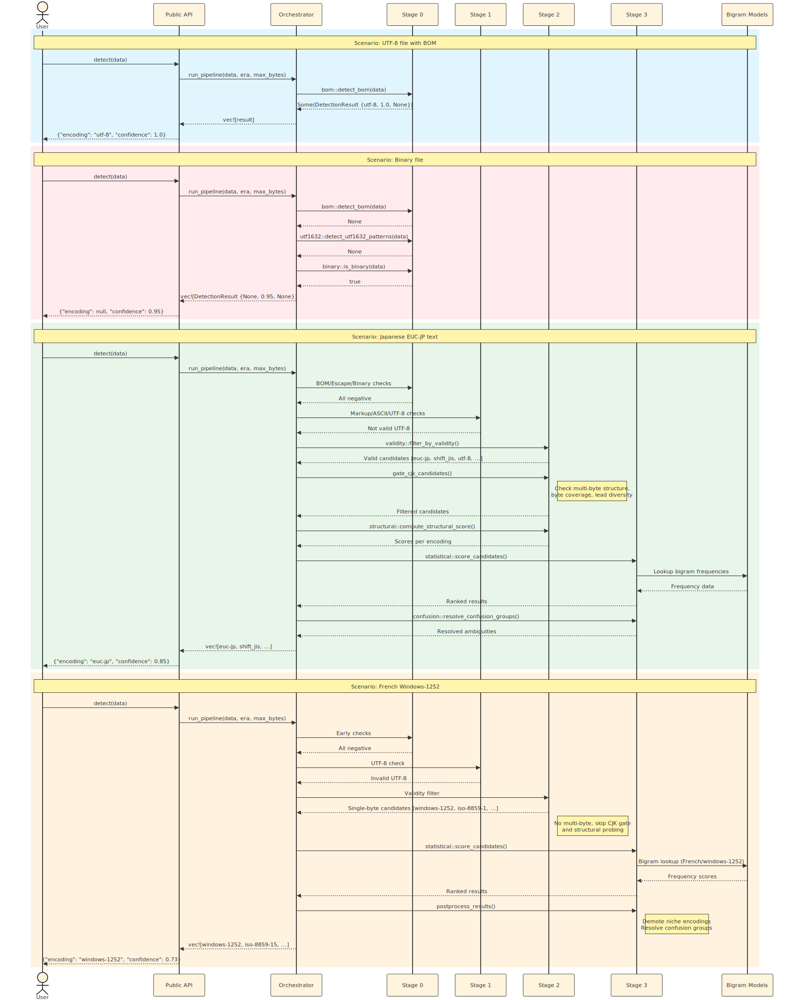

# Complete Rust Code Documentation

## Overview

This is a port of the chardet Python library to Rust with Python bindings using PyO3. The library provides universal character encoding detection with a multi-stage pipeline architecture.

## Architecture Diagrams

### Rust Module Architecture



The architecture diagram above shows the structure of the `chardet_rs` crate:

- **Public API** (blue): Entry points `detect()` and `detect_all()` exposed to Python
- **Pipeline Stages** (green): 12 detection stages from BOM detection to statistical scoring
- **Support Modules** (yellow): Registry, enums, equivalences, and model utilities
- **Data/Models** (purple): Bigram models and encoding metadata

### Detection Flow Sequence



The sequence diagram shows four common detection scenarios:

1. **UTF-8 with BOM**: Early exit at Stage 0 with 1.0 confidence
2. **Binary file**: Detected by magic numbers or null byte patterns
3. **Japanese EUC-JP**: Full pipeline execution through structural and statistical analysis
4. **French Windows-1252**: Single-byte encoding with statistical language detection

## Documentation Coverage

Every Rust source file now includes comprehensive documentation:
- **Module-level documentation**: Purpose, architecture, and usage
- **Struct/Enum documentation**: Purpose, fields, and examples
- **Function documentation**: Arguments, returns, behavior, and examples
- **Constant documentation**: Purpose and usage context
- **Algorithm documentation**: Step-by-step explanations of complex logic

## Project Structure

```
rust/
├── Cargo.toml           # Rust package configuration
├── src/
│   ├── lib.rs           # Main library entry point with Python bindings
│   ├── enums.rs         # Encoding era and language filter enums
│   ├── detector.rs      # UniversalDetector and detection functions
│   ├── registry.rs      # Encoding metadata registry (76 encodings)
│   ├── equivalences.rs  # Encoding name remapping and language inference
│   ├── models.rs        # Model loading utilities (documented)
│   ├── bigram_models.rs # Bigram statistical model loading and scoring
│   └── pipeline/        # Detection pipeline modules (fully documented)
│       ├── mod.rs       # Pipeline types and constants (documented)
│       ├── orchestrator.rs  # Pipeline orchestration
│       ├── bom.rs       # BOM detection (fully documented)
│       ├── ascii.rs     # ASCII detection (fully documented)
│       ├── utf8.rs      # UTF-8 validation (fully documented)
│       ├── utf1632.rs   # UTF-16/32 pattern detection (fully documented)
│       ├── binary.rs    # Binary file detection (fully documented)
│       ├── escape.rs    # Escape sequence encoding detection (fully documented)
│       ├── markup.rs    # HTML/XML charset extraction (fully documented)
│       ├── validity.rs  # Byte validity filtering (fully documented)
│       ├── structural.rs # Multi-byte structural analysis (fully documented)
│       ├── statistical.rs # Statistical scoring (fully documented)
│       └── confusion.rs # Confusion group resolution (fully documented)
```

---

## Module Documentation Summary

### 1. `lib.rs` - Main Library Entry Point

**Purpose**: Exports the public API and defines Python bindings using PyO3.

**Documented Items**:
- `detect()` - One-shot encoding detection with options
- `detect_all()` - Get all candidate encodings
- `_chardet_rs` module initialization

**Python API**:
```python
import chardet_rs

# Simple detection
result = chardet_rs.detect(b"Hello World")

# Detection with options
result = chardet_rs.detect(
    data,
    should_rename_legacy=True,
    encoding_era=chardet_rs.EncodingEra.ALL,
    max_bytes=200000
)

# Get all candidates
results = chardet_rs.detect_all(data, ignore_threshold=False)
```

---

### 2. `enums.rs` - Enumerations

**Purpose**: Defines bit flag enums for filtering detection candidates.

**Documented Items**:
- `EncodingEra` - 7 variants with bit flags (ModernWeb=1 through All=63)
- `LanguageFilter` - chardet 6.x compatibility enum
- Bitwise operations (`__and__`, `__or__`, `__contains__`)

---

### 3. `detector.rs` - UniversalDetector

**Purpose**: Streaming character encoding detector compatible with chardet's API.

**Documented Items**:
- `UniversalDetector` struct with all fields
- `new()` - Constructor with parameter validation
- `feed()` - Incremental data feeding
- `close()` - Finalization and result retrieval
- `reset()` - Detector reuse
- `detect_bytes()` - One-shot detection
- `detect_all_bytes()` - All candidates detection

---

### 4. `registry.rs` - Encoding Registry

**Purpose**: Central registry of all 76 supported encodings with metadata.

**Documented Items**:
- `EncodingInfo` struct with all fields documented
- `REGISTRY` static - Lazy-initialized HashMap
- `get_candidates()` - Era-based filtering
- All 76 encoding entries organized by era

---

### 5. `equivalences.rs` - Encoding Equivalences

**Purpose**: Legacy encoding name remapping and language inference.

**Documented Items**:
- `PREFERRED_SUPERSET` - Mapping of 14 legacy→modern encodings
- `apply_legacy_rename()` - Applies superset mapping
- `infer_language()` - Maps 80+ encodings to ISO 639-1 codes
- Complete language coverage table

---

### 6. `models.rs` - Model Utilities

**Purpose**: Utilities for model-based language detection.

**Documented Items**:
- `VARIANT_ENCODINGS` - List of 20 encodings with language variants
- `has_model_variants()` - Check if encoding has multiple languages
- `infer_language()` - Wrapper around equivalences function
- `score_best_language()` - Score data against language variants

---

### 7. `bigram_models.rs` - Bigram Statistical Models

**Purpose**: Loading and scoring using pre-trained bigram language models.

**Documented Items**:
- `BIGRAM_TABLE_SIZE` - 65536 possible byte pairs
- `NON_ASCII_BIGRAM_WEIGHT` - Weight factor for non-ASCII
- `load_models()` - Binary format parser
- `init_models()` - Model initialization
- `score_best_language()` - Cosine similarity scoring
- `build_weighted_profile()` - Input data profiling
- `score_profile_with_model()` - Profile comparison

---

### 8. Pipeline Modules

#### 8.1 `pipeline/mod.rs` - Pipeline Foundation

**Purpose**: Core types and constants used throughout the pipeline.

**Documented Items**:
- `DETERMINISTIC_CONFIDENCE` - 0.95 for structural detections
- `MINIMUM_THRESHOLD` - 0.20 for result filtering
- `DEFAULT_MAX_BYTES` - 200,000 byte limit
- `DetectionResult` - Complete struct documentation
- `PipelineContext` - Caching context with all fields

---

#### 8.2 `pipeline/orchestrator.rs` - Pipeline Orchestrator

**Purpose**: Coordinates all detection stages in sequence.

**12-Stage Pipeline Flow**:

| Stage | Module | Purpose | Exit Early? |
|-------|--------|---------|-------------|
| 0a | `bom` | BOM detection | Yes (1.0 confidence) |
| 0b | `utf1632` | UTF-16/32 patterns | Yes (0.95 confidence) |
| 0c | `binary` | Binary detection | Yes (binary result) |
| 0d | `escape` | Escape sequences | Yes (0.95 confidence) |
| 1a | `markup` | HTML/XML charset | Yes (0.95 confidence) |
| 1b | `ascii` | ASCII detection | Yes (1.0 confidence) |
| 1c | `utf8` | UTF-8 validation | Yes (0.80-0.99 confidence) |
| 2a | `validity` | Byte validity filter | No (filtering) |
| 2b | `structural` | CJK gating | No (filtering) |
| 2c | `structural` | Structural scoring | Conditional |
| 3 | `statistical` | Statistical scoring | No (scoring) |
| Post | `confusion` | Confusion resolution | No (reordering) |

---

#### 8.3 `pipeline/bom.rs` - BOM Detection

**Purpose**: Detect Byte Order Marks at the start of data.

**Documented Items**:
- `BOMS` table - 5 BOM patterns (UTF-32/16/8)
- `detect_bom()` - Main detection function with UTF-32 payload validation
- `bom_size()` - Get BOM size for encoding
- `strip_bom()` - Remove BOM from data

**BOM Table**:
| BOM Bytes | Encoding | Size |
|-----------|----------|------|
| `\x00\x00\xFE\xFF` | UTF-32-BE | 4 bytes |
| `\xFF\xFE\x00\x00` | UTF-32-LE | 4 bytes |
| `\xEF\xBB\xBF` | UTF-8-SIG | 3 bytes |
| `\xFE\xFF` | UTF-16-BE | 2 bytes |
| `\xFF\xFE` | UTF-16-LE | 2 bytes |

---

#### 8.4 `pipeline/ascii.rs` - ASCII Detection

**Purpose**: Fast detection of pure ASCII content.

**Documented Items**:
- `detect_ascii()` - Main detection function
- `is_ascii_whitespace()` - Whitespace check helper
- `is_printable_ascii()` - Printable range check

**Allowed Bytes**:
- Tab (0x09), Newline (0x0A), Carriage Return (0x0D)
- Printable ASCII (0x20-0x7E)

---

#### 8.5 `pipeline/utf8.rs` - UTF-8 Validation

**Purpose**: Validate UTF-8 byte sequences per RFC 3629.

**Documented Items**:
- `BASE_CONFIDENCE`, `MAX_CONFIDENCE`, `MB_RATIO_SCALE` - Confidence curve parameters
- `detect_utf8()` - Main validation function
- `utf8_sequence_length()` - Get sequence length from leading byte
- `is_continuation_byte()` - Continuation byte check

**Validation Rules**:
| Leading Byte | Length | Restrictions |
|--------------|--------|--------------|
| 0xC2-0xDF | 2 | None |
| 0xE0-0xEF | 3 | E0: 2nd>=A0, ED: 2nd<=9F |
| 0xF0-0xF4 | 4 | F0: 2nd>=90, F4: 2nd<=8F |

---

#### 8.6 `pipeline/utf1632.rs` - UTF-16/32 Pattern Detection

**Purpose**: Detect UTF-16 and UTF-32 without BOM.

**Documented Items**:
- `SAMPLE_SIZE`, `MIN_BYTES_*` - Sampling parameters
- `UTF16_MIN_NULL_FRACTION` - Null byte threshold
- `detect_utf1632_patterns()` - Main detection
- `check_utf32()` - UTF-32 specific detection
- `check_utf16()` - UTF-16 specific detection
- `validate_utf16()` - Surrogate pair validation
- `looks_like_text()` - Text vs binary heuristic

**UTF-32 Detection**:
- BE: First two bytes null for BMP
- LE: Last two bytes null for BMP

**UTF-16 Detection**:
- BE: Nulls at even positions for ASCII
- LE: Nulls at odd positions for ASCII

---

#### 8.7 `pipeline/binary.rs` - Binary Detection

**Purpose**: Detect binary (non-text) content.

**Documented Items**:
- `BINARY_THRESHOLD` - 1% control character limit
- `NULL_BYTE_THRESHOLD` - 1% null byte limit
- `has_binary_signature()` - Magic number detection
- `is_binary()` - Main detection with two-stage approach

**Detected Signatures**:
| Format | Signature |
|--------|-----------|
| PNG | `\x89PNG` |
| GIF | `GIF8` |
| JPEG | `\xFF\xD8\xFF` |
| ZIP | `PK\x03\x04` |
| PDF | `%PDF` |
| RAR | `Rar!` |
| 7z | `7z\xBC\xAF` |
| MP3 | `ID3` |
| MP4 | `....ftyp` |

---

#### 8.8 `pipeline/escape.rs` - Escape Sequence Detection

**Purpose**: Detect stateful encodings using escape sequences.

**Documented Items**:
- `detect_escape_encoding()` - Main detection function
- `contains_subsequence()` - Pattern matching helper
- `has_valid_hz_regions()` - HZ-GB-2312 validation
- `find_subsequence()` - Position finder
- `B64_CHARS` - Base64 alphabet
- `has_valid_utf7_sequences()` - UTF-7 validation
- `is_common_unicode_char()` - Unicode block checker
- `decode_first_utf7_char()`, `decode_second_utf7_char()` - UTF-7 decoders
- `is_embedded_in_base64()` - Context checker
- `is_valid_utf7_b64()` - Base64 validation
- `base64_decode()` - Base64 decoder

**Detected Encodings**:
- ISO-2022-JP-2, ISO-2022-JP-2004, ISO-2022-JP-EXT
- ISO-2022-KR
- HZ-GB-2312
- UTF-7

---

#### 8.9 `pipeline/markup.rs` - Markup Charset Extraction

**Purpose**: Extract charset declarations from HTML/XML.

**Documented Items**:
- `SCAN_LIMIT` - 4096 byte scan limit
- `detect_markup_charset()` - Main extraction function
- `detect_xml_encoding()` - XML declaration parser
- `detect_html5_charset()` - HTML5 meta tag parser
- `detect_html4_charset()` - HTML4 meta tag parser
- `find_subsequence()` - Pattern finder
- `find_case_insensitive()` - Case-insensitive finder
- `normalize_declared_encoding()` - Name normalization
- `validate_bytes()` - Basic validation

**Supported Declarations**:
```xml
<?xml version="1.0" encoding="UTF-8"?>
<meta charset="utf-8">
<meta http-equiv="Content-Type" content="text/html; charset=utf-8">
```

---

#### 8.10 `pipeline/validity.rs` - Byte Validity Filtering

**Purpose**: Filter candidates by byte sequence validity.

**Documented Items**:
- `filter_by_validity()` - Main filtering function
- `is_valid_for_encoding()` - Encoding-specific dispatch
- `is_valid_multibyte()` - Multi-byte validation dispatch
- `is_valid_shift_jis()` - Shift_JIS rules
- `is_valid_euc_jp()` - EUC-JP rules
- `is_valid_euc_kr()` - EUC-KR rules
- `is_valid_gb18030()` - GB18030 rules
- `is_valid_big5()` - Big5 rules
- `is_valid_johab()` - Johab rules
- `is_valid_hz()` - HZ-GB-2312 rules

**Validation Rules**: Each encoding has specific lead/trail byte ranges validated.

---

#### 8.11 `pipeline/structural.rs` - Structural Analysis

**Purpose**: CJK multi-byte structural probing and gating.

**Documented Items**:
- `CJK_MIN_MB_RATIO` - 5% minimum valid sequences
- `CJK_MIN_NON_ASCII` - 2 minimum high bytes
- `CJK_MIN_BYTE_COVERAGE` - 35% minimum coverage
- `CJK_MIN_LEAD_DIVERSITY` - 4 minimum lead bytes
- `CJK_DIVERSITY_MIN_NON_ASCII` - 16 byte threshold for diversity check
- `compute_structural_score()` - Main scoring function
- `compute_multibyte_byte_coverage()` - Coverage calculation
- `compute_lead_byte_diversity()` - Diversity calculation
- `get_analysis()` - Cached analysis retrieval
- `analyze_encoding()` - Encoding-specific dispatch
- `analyze_*()` - Seven encoding-specific analyzers

**Analysis Metrics**:
1. Valid sequence ratio (valid / lead count)
2. Byte coverage (MB bytes / non-ASCII bytes)
3. Lead diversity (distinct lead byte values)

---

#### 8.12 `pipeline/statistical.rs` - Statistical Scoring

**Purpose**: Statistical bigram scoring for encoding detection.

**Documented Items**:
- `score_candidates()` - Main scoring orchestrator
- `score_with_models()` - Bigram model scoring
- `score_simplified()` - Fallback heuristic scoring
- `ByteProfile` - Byte frequency profile struct
- `create_byte_profile()` - Profile builder
- `score_multibyte_patterns()` - Pattern-based scoring
- `calculate_entropy()` - Shannon entropy calculator

**Scoring Modes**:
1. **With Models**: Cosine similarity with pre-trained bigram models
2. **Simplified**: Byte frequency entropy and pattern matching

---

#### 8.13 `pipeline/confusion.rs` - Confusion Resolution

**Purpose**: Resolve ties between similar single-byte encodings.

**Documented Items**:
- `BALTIC_DISTINGUISHING_BYTES` - 7 Baltic-specific bytes
- `KOI8U_DISTINGUISHING_BYTES` - 3 Ukrainian-specific bytes
- `ISO8859_16_DISTINGUISHING_BYTES` - 16 South-Eastern European bytes
- `has_baltic_distinguishing_bytes()` - Baltic checker
- `has_koi8u_distinguishing_bytes()` - KOI8-U checker
- `has_iso8859_16_distinguishing_bytes()` - ISO-8859-16 checker
- `get_top_language()` - Language extractor
- `resolve_confusion_groups()` - Main resolution function

**Confusion Pairs** (prefer Windows over ISO):
- ISO-8859-1 ↔ Windows-1252
- ISO-8859-2 ↔ Windows-1250
- ISO-8859-4/13 ↔ Windows-1257
- ISO-8859-5 ↔ Windows-1251
- KOI8-R ↔ Windows-1251
- (and 5 more)

---

## Build Configuration

### `Cargo.toml`
```toml
[package]
name = "chardet-rs"
version = "0.1.9"
edition = "2021"

[lib]
name = "_chardet_rs"
crate-type = ["cdylib", "rlib"]

[dependencies]
pyo3 = { version = "0.23", features = ["extension-module", "abi3-py310"] }
once_cell = "1.19"

[profile.release]
opt-level = 3
lto = true
codegen-units = 1
```

**Optimization Flags**:
- `opt-level = 3`: Maximum optimization
- `lto = true`: Link-time optimization
- `codegen-units = 1`: Single codegen unit

---

## Performance Characteristics

| Operation | Time Complexity | Space Complexity |
|-----------|-----------------|------------------|
| BOM Detection | O(1) | O(1) |
| ASCII Detection | O(n) | O(1) |
| UTF-8 Validation | O(n) | O(1) |
| Binary Detection | O(n) | O(1) |
| Structural Analysis | O(n) per encoding | O(1) |
| Statistical Scoring | O(n + m) | O(256) |

Where n = input size (capped at max_bytes), m = model entries

---

## Error Handling

The library uses Rust's `Result` type internally and converts to Python exceptions:
- `ValueError`: Invalid parameters
- `RuntimeError`: Model loading failures
- `TypeError`: Invalid operand types

---

## Documentation Standards Applied

Every public and private item now includes:

1. **Purpose**: What the item does
2. **Arguments**: Parameter names, types, and descriptions
3. **Returns**: Return type and value description
4. **Examples**: Usage examples (where applicable)
5. **Algorithm**: Step-by-step explanation (for complex functions)
6. **Constants**: Purpose and value explanations

### Documentation Format

```rust
/// Brief description of what this does.
///
/// Longer explanation of behavior, edge cases, and important details.
/// Multiple paragraphs are supported.
///
/// # Arguments
///
/// * `param1` - Description of first parameter
/// * `param2` - Description of second parameter
///
/// # Returns
///
/// Description of return value.
///
/// # Examples
///
/// ```
/// use crate::module::function;
///
/// let result = function(arg1, arg2);
/// assert_eq!(result, expected);
/// ```
pub fn function(param1: Type1, param2: Type2) -> ReturnType {
    // implementation
}
```

---

## Viewing Documentation

To view the generated documentation locally:

```bash
cd rust
cargo doc --open --no-deps
```

This will open the documentation in your default browser.
