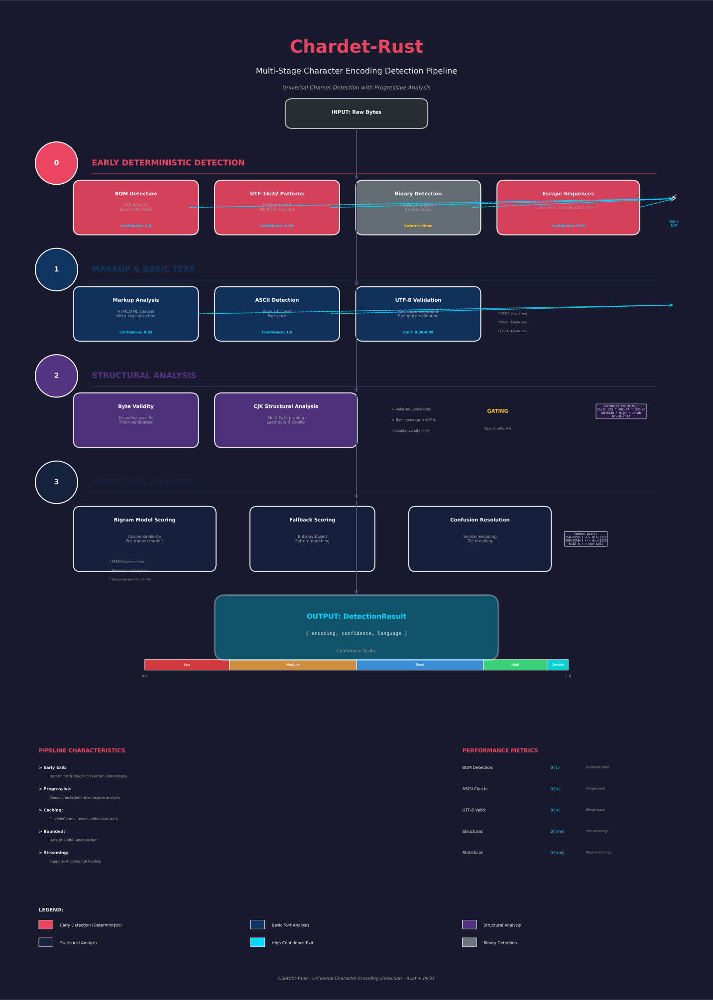

How It Works
============

chardet uses a multi-stage detection pipeline. Each stage either returns a
definitive result or passes to the next, progressing from cheap deterministic
checks to more expensive statistical analysis.

Implementation note: the production detection engine is implemented in Rust
(``rust/src``) and bound to Python as ``chardet_rs._chardet_rs`` via PyO3.
The Python package preserves the public API while delegating detection to the
Rust core.

Detection Pipeline
------------------

   Visual overview of the multi-stage encoding detection pipeline. The pipeline
   progresses from cheap deterministic checks (BOM detection, ASCII) through
   structural analysis to expensive statistical scoring when needed.

When you call :func:`chardet.detect`, data flows through these stages in
order:

1. **BOM Detection** — Checks for a byte order mark at the start of the
   data. If found, returns the corresponding encoding (UTF-8-SIG,
   UTF-16-LE/BE, UTF-32-LE/BE) with confidence 1.0.

2. **UTF-16/32 Patterns** — Detects BOM-less UTF-16 and UTF-32 by
   analyzing null-byte patterns. Interleaved null bytes strongly indicate
   UTF-16; groups of three null bytes indicate UTF-32.

3. **Escape Sequences** — Identifies escape-based encodings like
   ISO-2022-JP, ISO-2022-KR, and HZ-GB-2312 by matching their
   characteristic escape byte sequences.

4. **Binary Detection** — If the data contains null bytes or a high
   proportion of control characters without matching any of the above,
   it is classified as binary (encoding ``None``).

5. **Markup Charset** — Extracts explicit charset declarations from
   ``<meta charset="...">`` tags or ``<?xml encoding="..."?>``
   processing instructions.

6. **ASCII Check** — If every byte is in the 7-bit ASCII range, returns
   ``ascii`` immediately.

7. **UTF-8 Validation** — Tests whether the data is valid UTF-8 by
   checking multi-byte sequence structure. UTF-8 has very distinctive
   byte patterns that are unlikely to occur in other encodings.

8. **Byte Validity Filtering** — Attempts to decode the data with each
   candidate encoding's Python codec. Any encoding that raises a decode
   error is eliminated.

9. **CJK Gating** — Eliminates CJK candidates that lack genuine
   multi-byte structure. Checks pair ratio, high-byte count, byte
   coverage, and lead byte diversity to prevent false CJK matches on
   single-byte data.

10. **Structural Probing** — For multi-byte encodings (CJK), analyzes
    byte sequences to verify they follow the encoding's structural rules
    (lead byte / trail byte patterns, valid ranges).

11. **Statistical Scoring** — Scores remaining candidates using pre-trained
    bigram frequency models. Each model captures the characteristic byte
    pair frequencies of a language written in a specific encoding. The
    candidate with the highest score wins.

12. **Post-processing** — Resolves confusion groups (encodings that are
    statistically hard to distinguish), demotes niche Latin encodings
    when a more common alternative scores similarly, and promotes KOI8-T
    when appropriate.

Confidence Scores
-----------------

The confidence score (0.0 to 1.0) reflects how the result was determined:

- **1.0** — BOM detected (definitive)
- **0.95** — Deterministic match (escape sequences, markup charset, ASCII,
  BOM-less UTF-16/32, binary detection)
- **0.80–0.99** — UTF-8 detection. Confidence scales with the proportion of
  multi-byte sequences in the data.
- **< 0.95** — Statistical ranking. Higher scores mean the data better
  matches the encoding's expected byte pair frequencies.

Internal pipeline stages may temporarily boost confidence above 1.0 for
ranking purposes; ``run_pipeline`` clamps all final results to [0.0, 1.0].

A confidence of ``0.95`` with encoding ``None`` means the data appears to be
binary (not text).

Language Detection
------------------

chardet also returns the detected language alongside the encoding. Language
detection uses three tiers:

1. **Single-language encodings** — Encodings like Big5 (Chinese), EUC-JP
   (Japanese), or ISO-8859-7 (Greek) unambiguously identify the language.

2. **Multi-language encoding models** — For encodings shared across
   languages (e.g., windows-1252 is used for French, German, Spanish,
   etc.), the statistical scoring stage compares language-specific bigram
   models and picks the best-matching language.

3. **UTF-8 fallback** — For Unicode encodings (UTF-8, UTF-16, UTF-32),
   the detected text is scored against byte-level bigram models for all
   supported languages.

Architecture
------------

For a detailed view of the Rust implementation architecture, see:

* `Rust Architecture Diagram <rust_architecture.svg>`_ — Module structure and relationships
* `Detection Sequence Diagram <rust_sequence.svg>`_ — Flow through detection scenarios
* `RUST_CODE_DOCUMENTATION.md <RUST_CODE_DOCUMENTATION.md>`_ — Complete Rust API documentation
